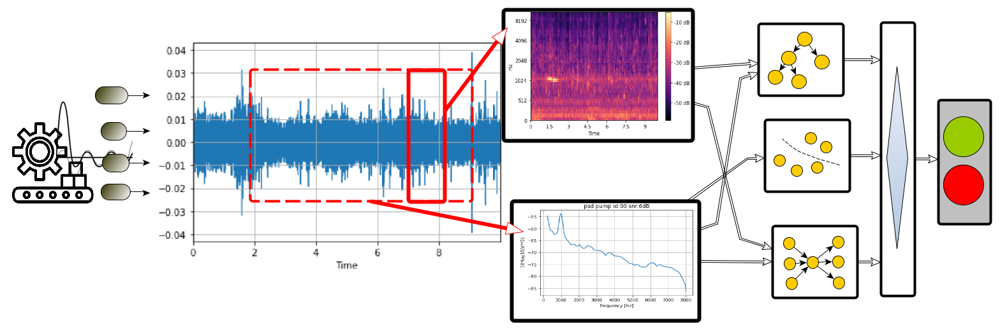
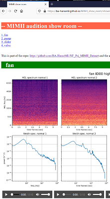

# Can a Machine Hear If a Machine Is Broken? 
**Unsupervised Anomaly Detection by Airborne Sound of Industrial Machinery**

A machine learning approach to machine anomaly detection on the MIMII dataset.

## Discription of the Study - in this Repo

This repo is about a concept study on the MIMII dataset to detect anomalies of machines or machine parts like fans, slider, pump and valves by means of classic machine learning and deep learning methods. 

In condition monitoring of machinery, it is common to use structure-borne sound and order tracking (RPM, etc.) to detect malfunctions. For various reasons like ease of retrofitting or the need for a mobile solution and size of the machine part or operational needs like zero downtime, airborne sound anomaly detection could be preferable. The proof of concept study conducted here, shows that by applying machine learning anomaly detection on acoustic sensing, a ML/AI sensor can be constructed that has good performance so that it can compete with a trained technician when detecting anomalies by listening to the machine, with the potential benefit of staying 24/7 at the machine part of interest. The development can be seen as groundwork for an embedded solution of a smart sensor as part of an IoT plant supervision system (like SCADA).

Anomaly detection with machine learning means mostly unsupervised learning as the base assumption is that abnormal operation is unknown. Abnormal operation could be potentially very diverse of nature, so even if the recordings of abnormal operation would exist training on them would lead to overfitting. Furthermore, the application of smart sensor would be less useful. 

This means a smart sensor microphone system needs to be trained by being placed for a reasonable training time in front of a healthy machine part, to become an armed detector that learned what is normal under representative background noise. Herein lies also the limitations of the study as in a real-world scenario more machine parts are connected and the dataset specifically focuses on a single part. But a general abnormality detection also for an ensemble of machine parts could be applicable with the same technique.

To reach an optimal architecture various machine learning techniques are explored and eventually a divers ensemble connected. The following list summarizes the techniques explored:

*	Stochastic model (a multi-dimensional normal distribution is found and outlier defined by significance)
*	Random Isolation trees (a decision tree is taken assuming outlier need only a few decisions to be found as spatially separated in one or more features)
*	Autoencoder (an underrepresented auto encoder reconstruction error is taken)
*	Pseudo supervision (where normal observation is augmented/ distorted to train a binary classifier)

In the picture below an exemplary classification ensemble is sketched, this is an example to show the main parts that are:

*	Feature extraction pre-filter like BSS blind source separation or denoising filter
*	Feature extraction like welch spectra (PSDs) or MEL spectra  
*	Classifier like RFC random forest classifier
*	Stochastic models for outlier detection like GMM gaussian mixture model, etc.
*	Unsupervised outlier detection like neural network autoencoder 
*	Or outlier classification like IFC isolation forest classifier
*	The time frame-based ensemble collects different classification over the time processed as some classifiers work on longer buffer parts than others. This may help to regulate the training of the algorithms and can improve training speeds.

In order to make any machine learning algorithm able to work with audio it is necessary to use various signal processing steps (feature extraction pre filter) that may be of classic nature or also take use of machine learning methods like clustering for preprocessing on the time buffer like activation detection. 
In application the reaction time of such an anomaly detection is around 10 sec at the current construction and training chain buildup. But some indication could be found to reduce this eventually.

## About the Dataset MIMII

The data have a general discretion through the ZENODO page where it is open for [download](https://zenodo.org/record/3384388#.XpNAUpnRYuV)

The related [paper](https://arxiv.org/pdf/1909.09347.pdf) by the MIMII dataset creators  - Harsh Purohit, Ryo Tanabe, Kenji Ichige, Takashi Endo,Yuki Nikaido, Kaori Suefusa, and Yohei Kawaguchi can be found here: https://arxiv.org/pdf/1909.09347.pdf

At this point we like to sincerely thank you for sharing the dataset, it serves a great challenge!

Some further interpretation from our end can be found in the sub chapter: [about the dataset](doc/about_the_dataset.md)

Furthermore the MIMII creators also provided an autoencoder based baseline model on GitHub:
https://github.com/MIMII-hitachi/mimii_baseline
This repo was of great help to get into the topic and inspired us.

### Dataset audtion show room

Maybe you like to tune in, listen and have a look to some spectra of a small selection from the MIMII dataset, to get better feeling it.
visit the show room:

[link to the showroom](https://ba-hanseml.github.io/MIMII_show_room/showroom.html)

## Structure of Study = How to read the Repo

The repo has some folders that correspond to either setup or the main chapters of the study. Here you can find some overview information and links to the in depth chapters.

### Study parts and Algorithm part

#### Folder/part: feature_extraction_diagram
The feature extraction diagram is a chain of filters and feature extractions like the MEL spectrum as an output. Thereby the folder hosts the tuning and test of the components, finally used ones and explored ones. As well as the batch creation scripts for pre-processing the dataset. More in the sub chapter [feature extraction diagrams](doc/feature_extraction.md)

#### Folder/part: Modeling
The modeling folder hosts all the explored machine learning variants sorted in sub folders like each with general dicription: 
* [unsupervised](modeling/unsupervised/unsupervised_modeling.md)
* [pseudo_supervised](modeling/pseudo_supervised/pseudo_supervised.md)

### Setup

#### Folder: dataset
Hosts the unpacked dataset from the zenodo site. The structure expected is discribed in the subchapter: [dataset folder structure](dataset/dataset_struct.md).
Additionaly it has folders for the extracted features after using the diagrams (see above).

#### Folder: Utiliy
Utility-function and classes stored in py-files rather than jupyter notebooks. In the folder utility/Workshop some application and basic tests of the utilities can be found.

#### Folder: doc
All subchapter and media material for documention.

#### Folder: ref
References like papers, etc. see below.

#### Folder: env
Information about the Conda environment, Jupyter settings and GPU elements in tensorflow. Notice this work was done on windows 10 with anaconda and jupyter.

#### Folder: misc
miscellaneous material and interesting site experiments - partially unsorted.

# Future Work

## Not Explored Options And Missing Ends
A list of general potential for improvement and not fully or not at all explored techniques mostly due to time restrictions. Sub Chapter [improvements](doc/improvements.md)

## Application Notes
Notes for the application as a smart sensor. A small discussion on implication and follow-up-work for deployment. Sub chapter: [application notes] (doc/feature_extraction. MD) 

## Workflow Improvements
Some reflection on workflow chosen and setup. Sub chapter [workflow improvements](doc/workflow_improvment.md) 

# Credits and Refrences

## THANKS to...

To the creators of the MIMII dataset

To the creators of the gigantic audio processing library [librosa](https://librosa.github.io/)

To the creators of the library [pyrommacustics](https://pyroomacoustics.readthedocs.io/en/pypi-release/)

To all the developers of python, scipy, numpy, scikit learn and tensorflow ... and all the great python stuff that we can build on.

To Mike X Cohen for his great Python DSP [Udemy courses](https://www.udemy.com/user/mike-x-cohen/) 

To all the founders and minds of machine learning you created an awesome universe to explore.

To the team at [neuefische GmbH](https://www.neuefische.de), that made this project possible by training us in the data science bootcamp.

To so many more form the web like towardsdatascience.com and stackoverflow ...

## References 
Find all references: papers, source code and other web sources in the following sub chapters: 

* [Papers and Books](ref/paper_list.md)   
* [Sorce code / GitHubs](ref/github_list.md)
* [Websites / Videos](ref/web_list.md)
