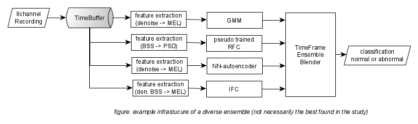

# Can a machien hear if a machine is broken

## Discription of the Study - in this repo

This repo is about a concept study on the MIMII dataset to detect anomaly of machines or machine parts like fans, slider, pump and valves by means of classic machine learning and  deep learning methods. 

In condition monitoring of machinery, it is common to use structure-borne sound and order tracking (RPM, etc.) to detect malfunctions, for various reasons like ease of retrofitting or need for a mobile solution and size of the machine part or operational needs like zero downtime, airborne sound anomaly detection could be preferable. The proof of concept study conducted here, shows that by applying machine learning anomaly detection on acoustic sensing, an ML/AI sensor can be constructed that has good performance so that it can compete with a trained technician when detecting anomalous by listen to the machine, with the potential benefit of staying 24/7 at the machine part of interest. The development can be seen as groundwork for an embedding solution of smart sensor as a part of an IoT plant supervision system (like SCADA).

Anomaly detection with machine learning means mostly unsupervised learning as the base assumption is that abnormal operation is unknown. Abnormal operation could be potentially very diverse of nature, so even if the recordings of abnormal operation would exist training on them would lead to over fitting. Furthermore, the application of smart sensor would be lesser useful. 

This means a smart senor microphone system needs to be trained by being placed for a reasonable training time in front of a healthy machine part, to become an armed detector that learned what is normal under representative background noise. Herein lies also the limitations of the study as in a real-world scenario more machine parts are connected and the dataset specifically focuses on one part. But a general abnormally also of an ensemble of machine parts could be possible with the same technique.

To reach a optimum architecture various machine learning techniques are explored and eventually a divers ensemble connecting, the following list summarizes the techniques explored:

*	Stochastic model (a multi-dimensional normal distribution is found and outlier defined by significant)
*	Random Isolation trees (a decision tree depth is taken assuming outlier need only view decisions to be found as spatial separated in one or more feature)
*	Auto encoder (an underrepresented auto encoder reconstruction error is taken)
*	Pseudo supervision (where normal observation is augmented/ distorted to train a binary classifier)

In the picture bellow a expletory classification ensemble is sketched, this is a example to show the main parts that are:

*	Feature extraction pre-filter like BSS blind source separation or denoising filter
*	Feature extraction like welch spectra (PSDs) or MEL spectra  
*	Classifier like RFC Random Forrest Classifier
*	Stochastic models for outlier detection like GMM Gaussian Mixture Model, etc.
*	Unsupervised outlier detection like Neural Network Autoencoder 
*	Or Outlier classification like IFC isolation forest classifier
*	The time frame-based ensemble collects different classification over the time processed as some classifier work on longer buffer parts then others this may helps to regulate the training of the algorithms and can improve training speeds.

In order to make any machine learning algorithm able to work with audio it is necessary to use various signal processing steps (feature extraction pre filter) that may be of classic nature or also take use of machine learning methods like clustering for preprocessing on the time buffer like activation detection. 
In application the reaction time of such a abnormally detection is around 10 sec at the current construction and training chain build up but some indication could be found to reduce this eventually. 

## About the data set

The data have a general discretion through the ZENDO page where it is open for [download](https://zenodo.org/record/3384388#.XpNAUpnRYuV)

The related [paper](https://arxiv.org/pdf/1909.09347.pdf) by the MIMII dataset creators  - Harsh Purohit, Ryo Tanabe, Kenji Ichige, Takashi Endo,Yuki Nikaido, Kaori Suefusa, and Yohei Kawaguchi can be found here: https://arxiv.org/pdf/1909.09347.pdf

At this point we like to sincerely thank you for sharing the data set, it serves a great challenge!

Some further interpretation from our end can be found in the sub chapter: [about the dataset](doc/about_the_dataset.md)

Furthermore the MIMII creators also provided an autoencoder based baseline model on GitHub:
https://github.com/MIMII-hitachi/mimii_baseline
This repo was of great help to get into the topic and inspired us.

## Structure of Study = How to read the Repo

The repo has some folders that correspond to ether setup or the main chapters of the study find here some overview information and links to the in depth chapters.

### Study parts and Algorthem part

#### Folder/part: feature_extraction_diagram
The feature extraction diagram is chain of filters and feature extractions like the MEL spectrum as an output. Thereby the folder host the tuning and test of the components finally used ones and explored ones. As well as the batch creation scripts for the pre-processing the dataset. More in the sub chapter [feature extraction diagrams](doc/feature_extraction.md)

#### Folder/part: Modeling
The modeling folder hosts all the explored machine learning variants sorted in sub folders like each with general dicription: 
* Stochastic 
* [pseudo_supervsed](modeling/pseudo_supervised/pseudo_supervised.md)

### Setup 
### Folder: dataset
host the unpacked dataset from the zendo site the structure expected is discrped in the sub chapter: [dataset folder structure](dataset/dataset_struct.md).
Attintionly it has folders for the extracted features after using the diagrams (see above).

##### Folder: Utiliy
Utility-function and classes stored in py-files rather than jupyter notebooks. In the folder utility/Workshop some application and basic tests of the utilities can be found.

#### Folder: doc
all subchapter and media material for documention

#### Folder: ref
refernces like papers, etc. see below.

#### Folder: env
Information about the Conda environment, Jupyter settings and GPU elements in tensor flow. Notice this work was done on windows 10 with anaconda and jupyter.

#### Folder: sub_notebooks = MISC
miscellaneous material and interesting site experiments - partially unsorted.

# Future Work

## not explored options and missing ends
A list of not fully or not at all explored techniques mostly do to time restriction. And general potential for improvement. Sub Chapter [imporvments](doc/imporvments.md)

## application notes
Notes for the application as a smart sensor a small discussion on implication and follow up work for deployment. Sub chapter: [application notes] (doc/feature_extraction. MD) 

## workflow improvments
Some reflection on workflow chosen and setup. Sub chapter [workflow improvments](doc/workflow_improvment.md) 

# Credits and Refrences

## THANKS to...

To the creators of the MIMII dataset
To the creators of the gigantic audio processing library [librosa](https://librosa.github.io/)
To the creators of the library [pyrommacustics](https://pyroomacoustics.readthedocs.io/en/pypi-release/)
To all the developers of python, scipy, numpy, scikit learn and tensorflow ... and all the great python stuff that we can build on.
To Mike X Cohen for his great Python DSP [Udemy courses](https://www.udemy.com/user/mike-x-cohen/) 
To all the founders and minds of machine learning you created a awesome universe to explore.

To the team at [neuefisch GmbH](https://www.neuefische.de), that made this project possible by training us in the data scince bootcamp.

To so many more form the web like towardsdatascience.com and stackoverflow ...

## Refernces 
Find all references: papers, source code and other web sources in the following sub chapters: 

* [Papers and Books](ref/paper_list.md)   
* [Sorce code / GitHubs](ref/github_list.md)
* [Websites / Videos](ref/web_list.md)

