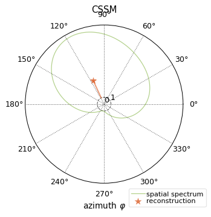
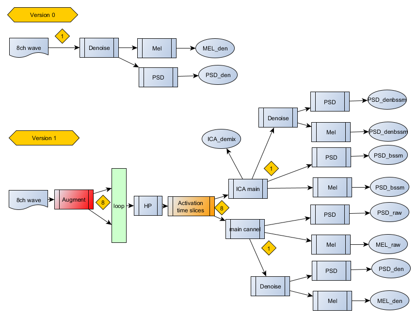

# Feature Extraction 

## Introduction 

Audio feature extraction is the diverse set of filters to get features extracted from the raw recording ready for a machine learning algorthem to process it. While cleaning operation like de-noising or de-reverbing are done. Further, it can be attempted to use multi channel recordings that are done with spatial separated microphone arrays, like this dataset is recorded with 8 microphones in a circle.  The feature could be formulated in the time domain but usually are left in frequency domain so that the output is a form of the spectrum like Welch in 1D or a STFT or alike in 2D. Other outputs are possible like envelopes BSS (blind source separation) de-mixing estimations or DOA (direction of arrival) as well as basic statistics like SNR (sound to noise ratio) estimation or standard deviation etc.

In this study, we settled with:
* MEL spectrum
* Welch spectrum ( called PSD here, even then, even if not it is not the density, but the spectral power V^2 instead of V^2/f)
* FastICA mixing matrix estimation

We also explored other forms find below remarks to that exploration.

For pre-filtering we settled on:
* nn-filter denoising
* FastICA
* K means clustering on STFT to find activation

Further audio augmentation for pseudo supervision is a topic in feature extraction.

In the documentation many links lead to Jupyter notebooks in the the folder feature_extraction_diagrams.

## Diagrams

A feature extraction diagram is a representation of flow diagram that draws the processing steps from the raw input audio towards the output port.
An output port is a spectrum of some kind either 1D or 2D, or some other data like ICA demix matrix. in this study we have mostly used an MEL Spectra and Welch spectra.
While the connection between input port and output port is a path of filters, these filters are drawn out inside the diagram.A feature extraction diagram is a class that consists of the diagram formulated in code and the necessary memory to accumulate multiple processing's off inputs. This helps in maintaining many input files and all the extracted features in memory before writing them to disk. This assists in computational speed as its prohibiting writing out multiple small files - We are using it to process all audio files of one machines ID into one single pickle file.. Also it is possible to have multiple diagrams at the same time this on the other hand helps to distribute the processing for feature extraction throughout multithreading.

The individual diagram classes are deprived from one model and the overloaded functions are only one to initialize and the other for the diagram.

In the picture below of drawing of a diagram is shown by the ellipse is representing an output port and the boxes representing filters or other types of pre-processing this allows to document the code as a visual diagram.

The diagram shows very simple version of a feature extraction the document on the left side represents the raw input data. The square with the one represents the amount of channels as there are potentially eight coming from the eight microphones.

## Pre Pre Processing and Time Sliceing or Activation detect

There are also pre pre-processing steps that are not strictly speaking a filter as they manipulate the attention in time. This means that the algorithm tries to automatically determine if the machine is active or not and discard the times of in activity for further filtering and spectra calculation.

The algorithm used in this study sents the raw data of one channel into PCA and then into a K means neighbor clustering. The naive assumption is that the clustering will only find two cluster one with activation and one without in terms of time frames. This works particularly well when the the recording shows significant changes while activation of the machine is happening this is also very often the case. The study has found that the use of this technique is particularly helpful with the valve as this particularly machine part is only active ends very short times the time wise focus on these activation times helps the classifier or outlier detector to learn better what normal sounds like as it automatically ignores times of inactivity that don't have any information about the machines characteristics. Thereby this preprocessing step can only be used for machines that are active sporadically. The supervision of continuous running machines don't benefit from this.

The implementation used in the study cut out the activation times and re-append them together to create from a 10 second file with some machine activation a 10 second file full of times with machine activation. This is a workaround that is only used to not break that downstream pipeline that had been constructed around files of the same length in terms of recording time.

## Augmentation

The augmentation of any audio file is done as a pre-step in the feature extraction diagram. The augmentation itself is done by randomly designing FIR filters that represent band passes and eventually shifting the frequencies a.k.a. pitching. This type of augmentation leads to the syntactic abnormal recording for the purpose of pseudo-supervised learning [read more about pseudo-supervised learning](../modeling/pseudo_supervised/pseudo_supervised.md). 

## Denoising

In order to reduce the background noise of a recording many techniques are possible. In this study we only used blind mono channel denoising, that means we have no detailed information of what is the signal and what is noise the assumption is that noise can be filtered based on its distribution in the spectrum. The most successful variant has been tuned and tested in the following notebook: [notebook](../feature_extraction_diagrams/A04_DenoiseDesign_mono/librosa_NNFilter_BlindDenoise.ipynb) 

Below is a picture of the result of that filter visualized as a MEL spectrum. You can see that this filter is successfully reducing the background noise content and sort of sharpening the essential components, this statement is derived by comparing the denoised spectrum with the recording where lesson noise was added.

In the example above which is a recording of a pump, where in the background you hear water splashing. It is particularly interesting that this splashing is attached by the filter it seems it is randomly enough distributors in the spectrum while the key permanent voices of the pump is maintained. Therefore this algorithm one is place and a feature extraction diagram.

The denoisng filter it's named [nn_filter](https://librosa.github.io/librosa/generated/librosa.decompose.nn_filter.html) from the library librosa.

Many more denoising and technics could be explored. In the feature extraction subfolder you can find some hints based on the library [pyroomacoustics](https://github.com/LCAV/pyroomacoustics). As soon as to be no using doesn't have to be blind even more powerful techniques could be possible by using outer adaptive filters etc.. 

## Main channel and DOA

To find the most interesting channel or microphone the simple assumption this that the microphone that points towards the derives is that microphone. While this would mean that any processing is done in mono finding of his direction can actually be out of the ties by using direction of arrival algorithms. This algorithm has maybe also the power to be used as a  spatial filter to reduce noise or focus better on the main source. All these automations have not been used yet but been initially explored in the notebook: [DOA_notebook](../feature_extraction_diagrams/A21_DirectionOfArrival_DOA/pyroomacustic_DOA.ipynb)

In the picture above the device is placed at 90° off the microphone ring as you can see the direction of arrival is estimated at least in the right sector and it might be even possible that the direction of arrival points much more accurately to the actual main source of noise. The placement of the device in relation to the microphone ring is known in from the descriptions of the data set what is not known is the size of the device. Further experimentation is required before a direction of arrival filter can be used.

But it proves the point that technology is available, out of the box that can be used to determine the main direction or the best channel.

## Source separation

One way to leverage the availability of multiple recordings in different spatial relationship is to try source separation. In this study we used individual component analysis from [scikit-lern (fastICA)](https://scikit-learn.org/stable/modules/decomposition.html#ica)

The individual component analysis is used under the naive assumption that there are only two sources in the recorded with 8 microphones namely background noise and machine noise. Then the assumption is that the source channel with the most diverse mixing coefficients will be more likely to have important information of the recording. Many other interpretation would be possible as a maximum of eight sources could be distinguished by eight microphones. But the microphone ring has a small diameter relative to space of interest, so that source separation at least in its simple version has a limited effectiveness. One interesting find though was that the estimated mixing matrix can also be used to determine anomalies. In the end it was outperformed by the spectrum - But if successful it would use only very few features. 

(Blind source separation techniques and you can find hints about that in the folder: feature_extraction_diagrams/A20_BSS_BlindSourceSeperation)

## Version of diagrams

Multiple versions of feature extraction diagram are created the picture below version 0 and one are depicted. All possible diagrams are recorded in the following file feature_extraction_diagrams/DiagramVersions.graphml

notice this file has been created with the tool [yEd](https://www.yworks.com/products/yed)

