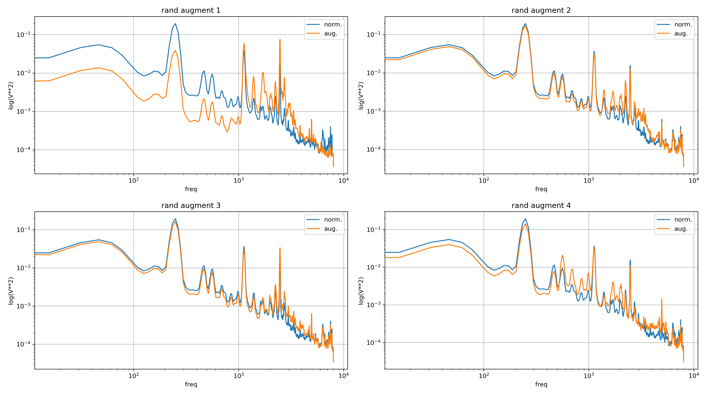
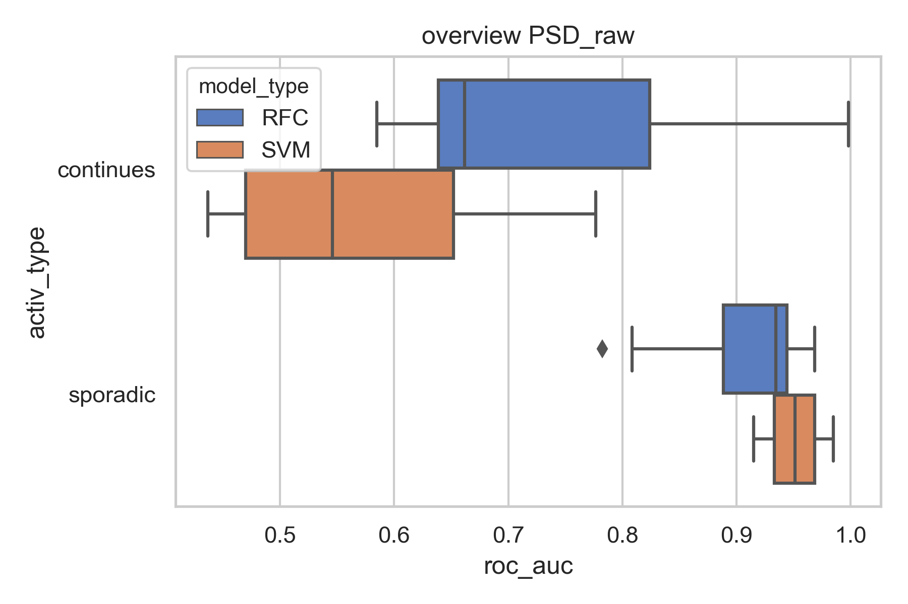
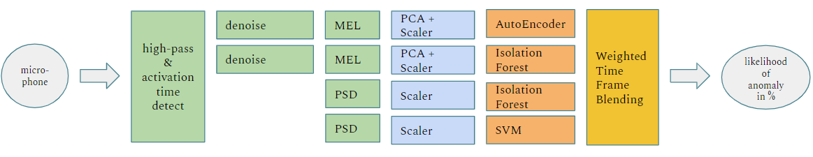

# Modeling Overlook

In general the prediction task is the detection of anomalous sound of industrial machine in an unsupervised manner. In the training phase only normal operation sounds are being considered, whereas we try to predict anomalous sound in the evaluation phase. 

The main challenge in the modeling process is to explore the vast space of model permutations and to pick the best models for certain features and combine them to an ensemble. This selection process is segmented:

+ First we are going to take a look at possible preprocessing steps like PCA and ICA. 

+ Second we will create a set of model permutations to explore the effect of different feature-types, model-types and hyperparameters. We will only consider the IDs 00 and 02 of each machine and SNR.

+ Third we select the most promising permutations from the subset we created. From those we will build our final ensemble.

+ Fourth we apply these ensembles to the remaining IDs 04 and 06 to evaluate the scoring

# Metric

Since we will always have a tradeoff between missed events and false alarms we use a metric that is independet of this tradeoff. Which is the ROC AUC score. The ROC AUC is our main metric to compare different models, feature types, etc. Additionally this allows us to compete against the baseline model.

# Preprocessing

Different types and complexities of data preprocessing have been investigated. The results of the investigation are can be seen in this subnotebook:

[Notebook](./../modeling/preprocessing/preprocessing_exploration.ipynb)

From the exploration of the Dimensionality Reduction we derived the following recommendations:

1. PCA and ICA deliver almost the same results looking at the relative absolute error
2. PCA is usually much faster
3. on PSD and the ICA demix matrix, no dimensionality reduction is needed
4. for a 5-framed Mel-spectrum a number of components between 32 and 64 is a good measure. The resulting error is about 2-4%
5. for a whole Mel-spectrum a number of components between 64 and 128 is advised

# Model Types

The Modeling part was approached from two perspectives. We followed a pure unsupervised approach with the stochastic and Autoencoder models and a pseudo-supervised approach by data augmentation following a classification.

## Unsupervised Approach

### Stochastic Models

Within the unsupervised approach we used two model types for anomaly detection. The stochastic approach makes use of models like:

+ Isolation Forest
+ Elliptic Envelope
+ Gaussian Mixture Model

which assume that the normal operation data belongs to a multi-dimensional distribution. These models are being trained to fit a model-specific representation of this distribution. After that the model is able to calculate whether a new instance can be reproduced from that distribution. The assumption is, that anomalous operation sound is significantly different from and can not be represented by the fitted distribution of normal operation sounds. Depending on the model for each evaluation instance a score or likelihood can be calculated that this instance belongs to the fitted distribution. This score or likelihood is being used as the prediction and from this the area under the curve of the receiver operating characteristic (ROC AUC) is being calculated. 

### Auto-Encoder

The second model type in the unsupervised approach is the Autoencoder. The Autoencoder is a type of artificial neural network specifically designed to learn a lower-dimensional representation of data. The network usually consists of a reduction side, called the Encoder, and a reconstruction side, called the Decoder. In a forward step the data is being "forced" into a lower dimensional form by the Encoder and transformed back into the original dimension by the Decoder. This results in a "condensed" representation of the original data and a reduction of noise. While training the metric is the reconstruction error between the input data and the decoded output data.

*Example of an Autoencoder, embedded from: https://miro.medium.com/max/1400/0\*uq2_ZipB9TqI9G_k

### Notebooks

The unsupervised approach can be reproduced using these notebooks:

1. [Model Building](unsupervised/unsup_model_building.ipynb)
2. [Model Exploration](unsupervised/unsup_model_exploration.ipynb)

We did not push all the models we created but a dataframe consisting most of the metaparameters and scores of the models. The model exploration process should be reproducable with the models_agg.dataframe. The dataframe will not be reproducable 100% since we created a lot of different models over the last weeks.

## Pseudo Supervised Classification

Pseudo supervised means training supervised classification model based on normal recordings and  synthetic abnormal. The synthetic abnormals are  constructed in the feature extraction by augmenting the normal with random distortions.

here a example that shows 4 times the same base line PSD and a diffrent random generated abnormal:

### Finding Models

#### Exploration approaches Step 1
In Step 1 all notebooks in this folder with a prefix “S01” are containing exploration of classic machine learning algorithms like SVM, RFC, log. reg. etc. . Some spot checks through out the possible machines and noise level are done to see if the pseudo supervised approach can work and to narrow down to the possibilities.

In this step some conclusion can be made:
* all algorithm fitting very well in training (this means the synthetic abnormal are in way to easy to distinguish)
* if the augmentation is not in feed back with the training exploration of more advanced algorithms like boosting or neural networks will not be able to create better results
* the augmentation form that is chosen right now is distorting the spectra over all time frames so that the 1d spectra are better feature.
* Random Forest and Support vector machine are most promising over all
#### Full training of the top Step 2
In Step 2 all notebooks in the folder with a prefix of “S02” that deal with training and summery of the two sets the design set ID00 and ID02 and the validation set ID04 and ID06
Conclusion in this step
* the approaches is promising as it can beat the auto encoder from the base line
* it is worth splitting the machines by activation type as different algorithm seem to fit better depending on the type – this all is based on combination of augmentation feat. Extraction and ML algorithm and might change if any part of the chain is changed
* the most promising combination is PSD_raw into a SVM for sporadic activated machines.

### Conclusion

The approached is generally promising but the augmentation can be improved in first step it will need more 2d factors and then it needs to be integrated into the training loop like a regulated convolution layer of a CNN. But in general, this allows to use supervised algorithm for this unsupervised task and also the very basic approach is creating good results.

# Ensemble

There is a high degree of freedom of different features, preprocessing steps, models, and hyperparameters. Possible permutations consist of 2 signal to noise ratios (SNR), 4 machines each SNR, 2 IDs each machine, 9 different feature-types each ID, results in 144 different permutations to explore before any selection of feature-parameter, model type or model-parameter.

## Individual Model Building

Over the IDs 00 and 02 for the signal to noise ratios of 6dB and -6dB trained various models of the types and hyperparameters were selected from the exploration of all the individual models.
These models can be reproduced running this notebook: [ensemble_exploration_model_building.ipynb](ensemble/ensemble_exploration_model_building.ipynb).

## Ensemble Evaluation

 In order to evaluate the models as an ensemble, this notebook was set up: [ensemble_evaluating.ipynb](ensemble/ensemble_evaluating.ipynb). The evaluation in this notebook is based purely combination of the predictions of all the individual models.

 ### Blender

 In terms of blending the individual models together a time-based and weighted approach has been chosen. Predictions always are being aggregated over a 10 seconds period for spectral data that uses windowed spectra.

 Secondly since all the predicted scores of all the individual models are in different scales, the predictions of each individual model based on the predictions of the test-set are being normalized. Like that everything can be measured as standard deviations apart from what has been seen in the training phase.

 Thirdly the normalized predictions of the individual models are being summed up weightedly according to their individual model performance. These weights are completely arbitrary. As mentioned in the [improvements.md](../docs/improvements.md) these weights can be optimized for best scores in the future.
 
 + Autoencoder MEL spectrum +30%
 + Isolation Forest MEL spectrum +0%
 + Isolation Forest welch -10%
 + Support Vector Machine augmented welch -20%

The resulting prediction is then used as likelihood of a sample being an anomaly. These scores are then being evaluated with the ROC AUC score. The results can be seen below:

## Results

Putting it all together the following results have been calculated. In a nutshell the results especially for the low noise domain are quite promising. The activation time detection on the sporadic machinery and also the noise cancelling deliver good results. Comparing to the individual model score the combination in an ensemble over all increased scores.

|            |      | 6dB      | 6dB    | -6dB     | -6dB  |
|------------|------|----------|--------|----------|-------|
|            | **ID**   | **baseline** | **ours**   | **baseline** | **ours**  |
| Valve      | 04   | 64.0%    | 99.9%  | 50.0%    | 91.7% |
|            | 06   | 70.0%    | 82.3%  | 53.0%    | 66.0% |
|            | Avg. | 67.0%    | 91.1%  | 51.5%    | 78.9% |
| Pump       | 04   | 99.0%    | 100.0% | 93.0%    | 97.4% |
|            | 06   | 94.0%    | 99.4%  | 61.0%    | 78.6% |
|            | Avg. | 96.5%    | 99.7%  | 77.0%    | 88.0% |
| Fan        | 04   | 92.0%    | 98.5%  | 57.0%    | 67.9% |
|            | 06   | 99.0%    | 99.7%  | 83.0%    | 91.8% |
|            | Avg. | 95.5%    | 99.1%  | 70.0%    | 79.9% |
| Slide rail | 04   | 88.0%    | 99.8%  | 61.0%    | 90.1% |
|            | 06   | 71.0%    | 97.6%  | 52.0%    | 75.4% |
|            | Avg. | 79.5%    | 98.7%  | 56.5%    | 82.7% |
| **over all**   | **Avg.** | **84.6%**    | **97.2%**  | **63.8%**    | **82.4%** |

For further information take a look into the [ensemble evaluation notebook](ensemble/ensemble_evaluating.ipynb) or the [main notebook](../MIMII_main.ipynb). These results were generated with the main notebook. And also the main notebook should be the easiest way to reproduce these results.

# References

[[1]](https://www.semanticscholar.org/paper/Detection-of-Abnormal-Sound-Using-Multi-stage-GMM-Ito-Aiba/27628c9aeecb4df6010693533ad79f4d03c64f86) Ito, Akinori, Akihito Aiba, Masashi Ito and Shozo Makino. “Detection of Abnormal Sound Using Multi-stage GMM for Surveillance Microphone.” 2009 Fifth International Conference on Information Assurance and Security 1 (2009): 733-736.